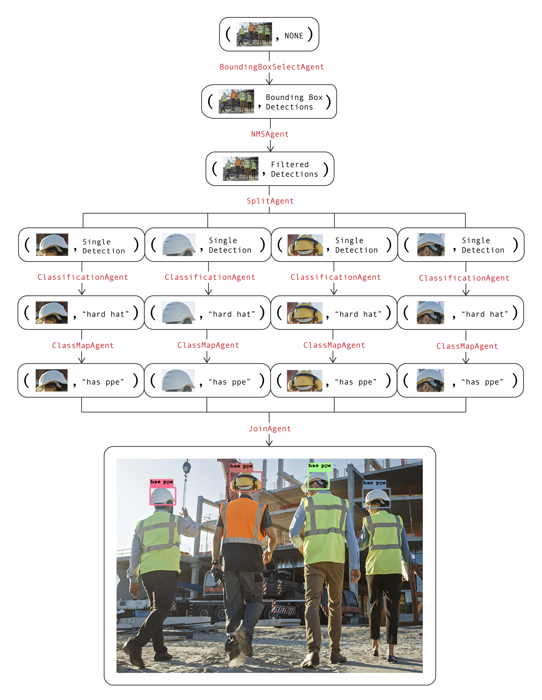

<h1 align="center"> 🥚 Overeasy
<br/>
<span align="center">
   <a href="https://pypi.org/project/overeasy/" target="_blank"></a>
   <a href="https://github.com/overeasy-sh/overeasy/blob/main/LICENSE"></a>
    <a href="https://docs.overeasy.sh"></a>
    <a href="https://colab.research.google.com/drive/1Mkx9S6IG5130wiP9WmwgINiyw0hPsh3c?usp=sharing#scrollTo=L0_U27WJaTNO""></a>
</span>
 </h1>


<p > <h3 align="center">Create powerful zero-shot vision models! </h3> </p>


Overeasy allows you to chain zero-shot vision models to create custom end-to-end pipelines for tasks like:

- 📦 Bounding Box Detection
- 🏷️ Classification
- 🖌️ Segmentation (Coming Soon!)

All of this can be achieved without needing to collect and annotate large training datasets. 

Overeasy makes it simple to combine pre-trained zero-shot models to build powerful custom computer vision solutions.


## Installation
It's as easy as
```bash
pip install overeasy
```

For installing extras refer to our [Docs](https://docs.overeasy.sh/installation/installing-extras).

## Key Features
- `🤖 Agents`: Specialized tools that perform specific image processing tasks.
- `🧩 Workflows`: Define a sequence of Agents to process images in a structured manner.
- `🔗 Execution Graphs`: Manage and visualize the image processing pipeline.
- `🔎 Detections`: Represent bounding boxes, segmentation, and classifications.


## Documentation 
For more details on types, library structure, and available models please refer to our [Docs](https://docs.overeasy.sh).

## Example Usage 

> Note: If you don't have a local GPU, you can run our examples by making a copy of this [Colab notebook](https://colab.research.google.com/drive/1Mkx9S6IG5130wiP9WmwgINiyw0hPsh3c?usp=sharing#scrollTo=L0_U27WJaTNO).


Download example image
```bash
!wget https://github.com/overeasy-sh/overeasy/blob/73adbaeba51f532a7023243266da826ed1ced6ec/examples/construction.jpg?raw=true -O construction.jpg
```

Example workflow to identify if a person is wearing a PPE on a work site:
```python
from overeasy import *
from overeasy.models import OwlV2
from PIL import Image

workflow = Workflow([
    # Detect each head in the input image
    BoundingBoxSelectAgent(classes=["person's head"], model=OwlV2()),
    # Applies Non-Maximum Suppression to remove overlapping bounding boxes
    NMSAgent(iou_threshold=0.5, score_threshold=0),
    # Splits the input image into images of each detected head
    SplitAgent(),
    # Classifies the split images using CLIP
    ClassificationAgent(classes=["hard hat", "no hard hat"]),
    # Maps the returned class names
    ClassMapAgent({"hard hat": "has ppe", "no hard hat": "no ppe"}),
    # Combines results back into a BoundingBox Detection
    JoinAgent()
])

image = Image.open("./construction.jpg")
result, graph = workflow.execute(image)
workflow.visualize(graph)
```

### Diagram

Here's a diagram of this workflow. Each layer in the graph represents a step in the workflow:
<!-- 
 -->

<picture>
  <source media="(prefers-color-scheme: dark)" srcset="https://raw.githubusercontent.com/overeasy-sh/overeasy/main/assets/graph-diagram-dark.png">
  <source media="(prefers-color-scheme: light)" srcset="https://raw.githubusercontent.com/overeasy-sh/overeasy/main/assets/graph-diagram.png">
  
</picture>

The image and data attributes in each node are used together to visualize the current state of the workflow. Calling the  `visualize` function on the workflow will spawn a Gradio instance that looks like [this](https://overeasy-sh.github.io/gradio-example/Gradio.html). 

## Support
If you have any questions or need assistance, please open an issue or reach out to us at help@overeasy.sh.


Let's build amazing vision models together 🍳!
