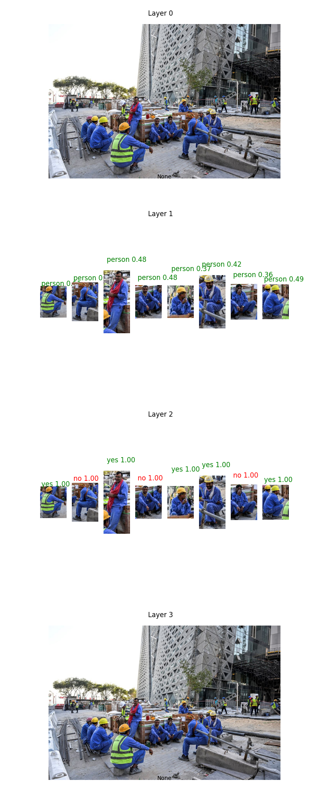

# 🎉 Announcing Overeasy v.0.0.3 

This repository contains code for **Overeasy**, a framework designed for constructing multi-step visual workflows. This library is engineered to simplify complex computer vision tasks by breaking them down into manageable, sequential operations. This methodology enhances the performance of models while boosting their interpretability.

Overeasy v0 focuses on `object detection` and `classification`.

# Key Components

## 🧩 Workflows

A `Workflow` defines a sequence of Agents that are executed in order, processing an image from input to final output upon execution. The output of each Agent is passed as an input to the next Agent in the Workflow. Workflows allow for the dynamic integration of various `Agents` based on the task requirement.

Overeasy currently supports these models for use in **Classification, Detection, LLMs, and Recognition** tasks:

- `Classification`: CLIP, OpenCLIPBase, LaionCLIP, BiomedCLIP
- `Detection`: YOLOworld, DETIC, GroundingDINO
- `LLMs`: QwenVL, GPT, GPT4Vision
- `Recognition`: TextractModel, RekognitionModel

## 🤖 Agents

Each `Agent` encapsulates a specific task related to processing an input image. This modular approach enables the construction of complex Workflows, where each Agent contributes its specialized expertise at a specific stage of the visual processing pipeline. 

Below is an overview of the Agents currently supported in our framework:

- `BoundingBoxSelectAgent`: This Agent is used to detect an object and select its bounding box from an image, as well as to crop the image to the detected box. It can also handle split detections, where multiple bounding boxes are found.
- `VisionPromptAgent`: This Agent is used to generate a response to a given query based on the content of an image. It uses a model to process the image and the query.
- `DenseCaptioningAgent`: This Agent is used to generate a detailed description of an image. It uses a model to process the image and generate the description.
- `BinaryChoiceAgent`: This Agent is used to make a binary choice (yes or no) based on the content of an image. It uses a model to process the image and generate the response.
- `ClassificationAgent`: This Agent is used to classify the content of an image into one of the specified classes. It uses a model to process the image and perform the classification.
- `OCRAgent`: This Agent is used to extract text from an image. It uses a model to process the image and perform the OCR.
- `FacialRecognitionAgent`: This Agent is used to recognize a face in an image. It uses a model to process the image and perform facial recognition.
- `JSONAgent`: This Agent is used to generate a JSON response based on the content of an image. It uses a model to process the image and generate the response.
- `JoinAgent`: This Agent is used to combine the results of multiple agents.

# Example Output

Let’s walk through an example using Overeasy. 

Say we’re interested in identifying the workers wearing hardhats in an input image.

## Code

```python
from overeasy import Workflow, BoundingBoxSelectAgent, BinaryChoiceAgent, JoinAgent, visualize_graph   
from PIL import Image
import overeasy as ov

# Load input image
image_path = "./construction.jpg"
image = Image.open(image_path)

# Create a new Workflow
workflow = Workflow()

workflow.add_step(BoundingBoxSelectAgent(classes=["person"], split=True))
workflow.add_step(BinaryChoiceAgent("Is this person wearing a hardhat?"))
workflow.add_step(JoinAgent())
result, graph = workflow.execute(image)

ov.logging.print_summary()

fig = visualize_graph(graph)
fig.savefig("workflow_result.png")
```

## Output



## Analysis

### Layer 0: Original Image

This is the original input image for our Workflow.

### Layer 1: Person Detection

Layer 1 uses a `BoundingBoxSelectAgent` to detect people in the original image, cropping out images of detected individuals. Associated with each image is a confidence score (between 0 to 1), which indicates how certain a model is that the cropped image contains a person. Here, a score of 0.48 indicates that the model is 48% certain the cropped image is a person. 

### Layer 2: Hardhat Detection

Layer 2 takes the output from Layer 1 and uses a `BinaryChoiceAgent` to determine whether the detected individual is wearing a hardhat. Each cropped image now has a label of "yes" or "no" with associated confidence scores. In this case, the confidence scores are all 1.00, which indicates that the model is 100% certain of its decision on whether the person is wearing a hardhat. 

### Layer 3: Final Output

The Workflow uses a `JoinAgent` to combine the results of the BoundingBoxSelectAgent and the BinaryChoiceAgent. The JoinAgent joins the predictions from the cropped images back into the original image.

# License

MIT License

